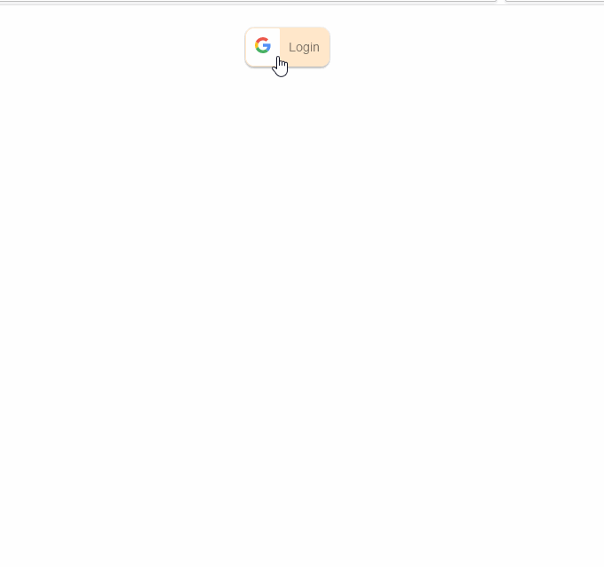

# react-google-auth




## Available Scripts

Try in latest browser

To install all dependency, run:

### `npm install`

To run locally, try:

### Complete this steps before run your app

Go to the [Credentials page](https://console.cloud.google.com/apis/credentials).( if first time then create a new project and follow bellow steps)

Click **Create credentials** > OAuth client ID.
Select the **Web application** type. and fill 
 - Name your OAuth 2.0 client (let's say `Web Auth App`)
 - Add Authorized JavaScript origins (let's say `http//localhost:3000`)
 - Add Authorized redirect URIs (let's say `http//localhost:3000`)

once you done with that, create a `.env` file, and add, your CLIENT_ID just you genrated

```
REACT_APP_CLIENT_ID = <xxxxxxxxxxxxYOUR-CLIENT_IDxxxxxxxxxxxxxx.apps.googleusercontent.com>

```

### `npm start`

Open [http://localhost:3000](http://localhost:3000) to view it in the browser.


To build the final project

### `npm run build`